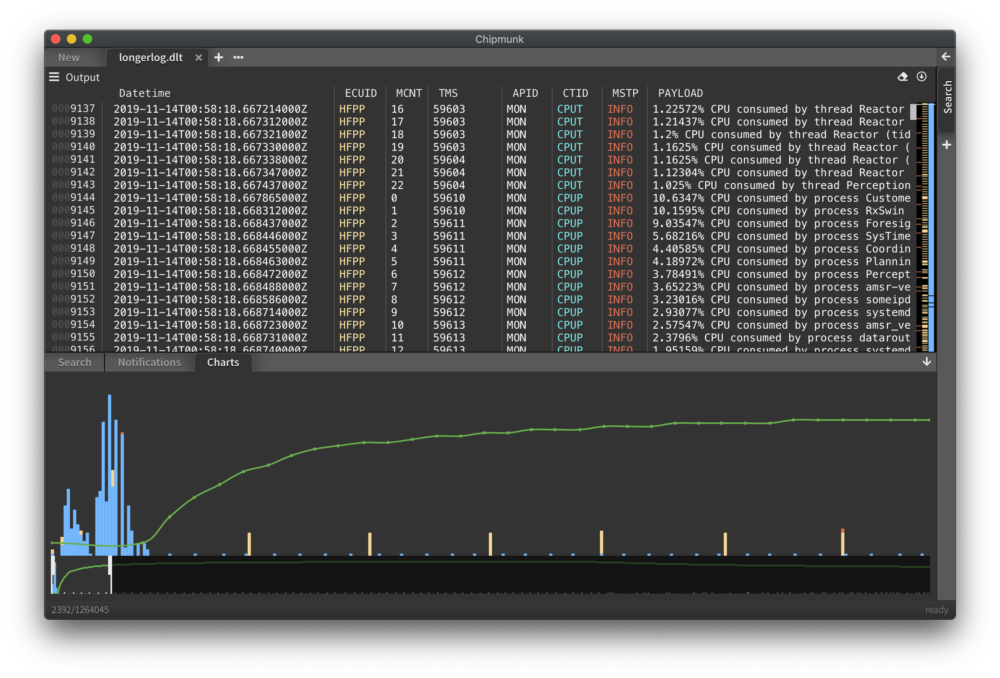

# Chipmunk Log Analyzer & Viewer

`chipmunk` is a fast logfile viewer that can deal with huge logfiles (>10 GB). It powers a super
fast search and is supposed to be a useful tool for developers who have to analyze logfiles.

## Download/Installation

The latest release can be downloaded [here](https://github.com/esrlabs/chipmunk/releases).

We support **MacOS**, **Linux** and **Windows**. 
(Releases on Windows and MacOS are signed.)
No installation is necessary, just download, unpack and execute.

## Documentation

We have a guide for using chipmunk [here](docs/README.md)

## Features

* open & search huge logfiles
* create filters or export/import them
* open **DLT** (Diagnostic Log and Trace) files (both verbose and none verbose)
* capture output from any shell command
* capture traffic on serial ports
* bookmarks
* developer friendly keyboard shortcuts
* extensible via plugin system

