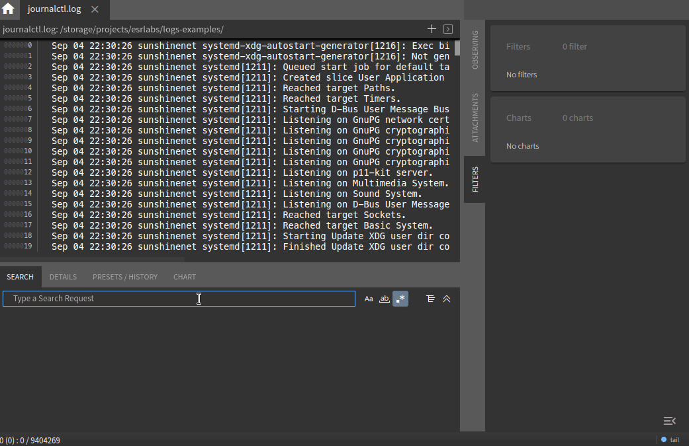

## Content
- [Creating filter(s)](./create.md)
- [Checked / uncheked / disabled](./manipulation.md)
- [Active search](./active.md)
- [Import / Export](./importing.md)
- [Breadcrumbs mode](./breadcrumbs.md)
- [Home](../features.md)

# Creating of filters

To create a filter:

- focus in search input
- enter the search condition
- press "Enter" to activate the search
- press "Enter" once again or click on the filter icon

As a result, the filter will be saved in a list of filters.
Chipmunk supports any number of filters/charts, but the performance of a search depends on the number of filters/charts.

