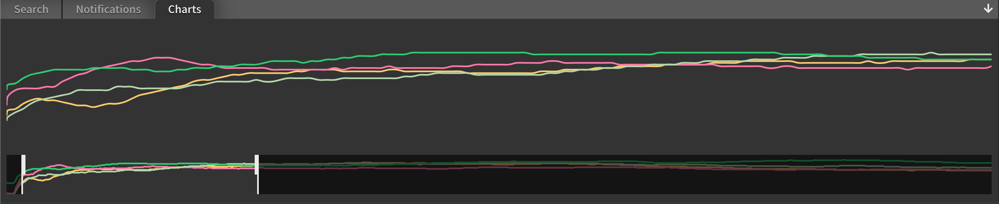
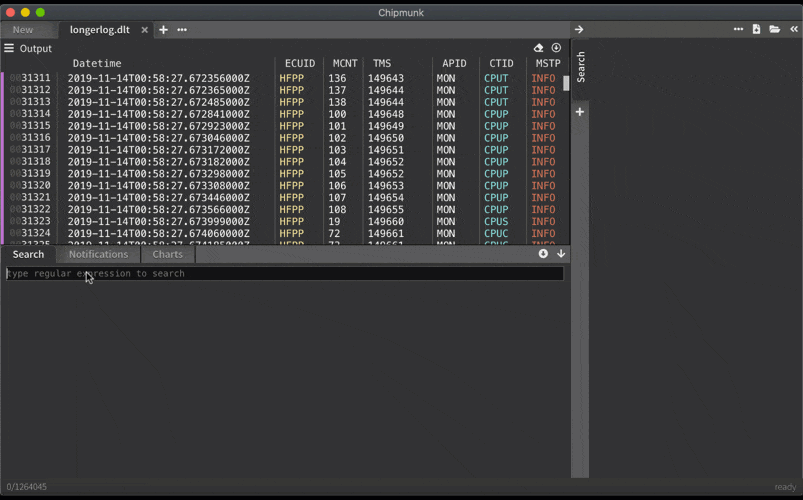

[back to overview](README.md)
# Charts

Getting a quick overview of what happened during a 24h-trace period can be daunting if the logfiles are huge (millions of log entries). A very neat way to get a quick overview is to show some graphs for what is happening.

In this graph we captured processor workload for different cores. Any numerical value can be captured by using a regular expression with a group.

Supported are
* integers
* floats

An example for a regular expression with such a capture group looks like this:

`measured:\s(\d+)`

This will match `measured: 42` and pull out the value `42`.
Here is an example of how this looks in action.

