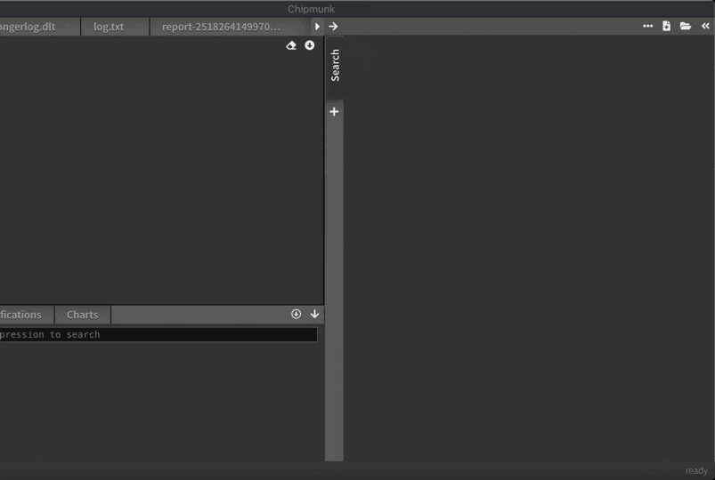

[back to overview](README.md)
# Assembling files

There is handy support for combining multiple files into one view. You simple drag & drop the files you need into a fresh tab. Then select the concatenate option.

Now you will have the chance to quickly check for a search expression to see if it is present in the dropped files. Here you can potentially include of exclude files.

