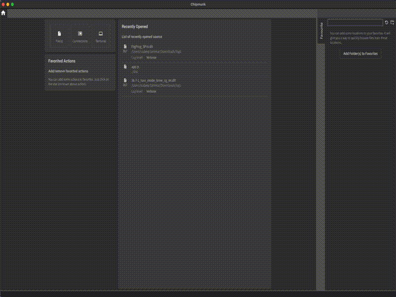
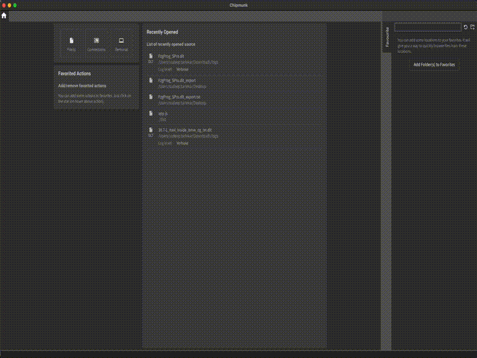
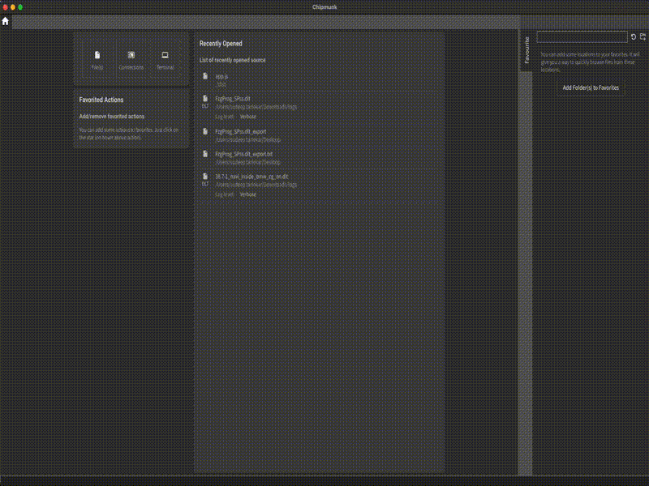

Chipmunk supports flexible import and export of log searches and filters,
allowing user to save filtered views or search results as standalone files
for sharing, archiving, or further analysis, and later re-import them to
quickly restore the same context.

### Exporting Logs as Plain Text

Once log files are imported into Chipmunk, user can easily export them as
plain text logs.
This is useful when user need to share logs with tools or colleagues that
do not support the specific log format, or when user want a lightweight,
human-readable version of the data.

### Exporting Search Results

Chipmunk allows user to search specific string or value in the logs and create
a search filter for logs. These filters can also be exported as CSV or just
plain raw logs.

When exporting a filtered view, Chipmunk supports two formats:

**Table**

1. The search results are exported as a structured text, or in other words CSV file.
2. This format is useful when you want to process logs with spreadsheets or 
data analysis tools (Excel, pandas, etc.).

**Raw**

1. The filtered results are exported as a plain-text `.dlt_export` file.
2. Each log entry is written line by line in a human-readable form, 
similar to how Chipmunk displays it in the viewer.
    
    This format is best for lightweight sharing, quick inspection, or use with 
text-based tools like grep or less.

### Exporting Presets

In addition to applying presets while analyzing logs, Chipmunk also lets you
export and import presets, so you can reuse them across sessions or share them 
with your team.
Chipmunk also allows user to export multiple presets at the same time.

### Importing Presets

Chipmunk also supports importing presets back into the tool. Imported presets
instantly recreate the same search conditions, so you don’t need to manually
re-enter complex queries.
Just like exproting multiple presets, Chipmunk allows user to import multiple
presets.

