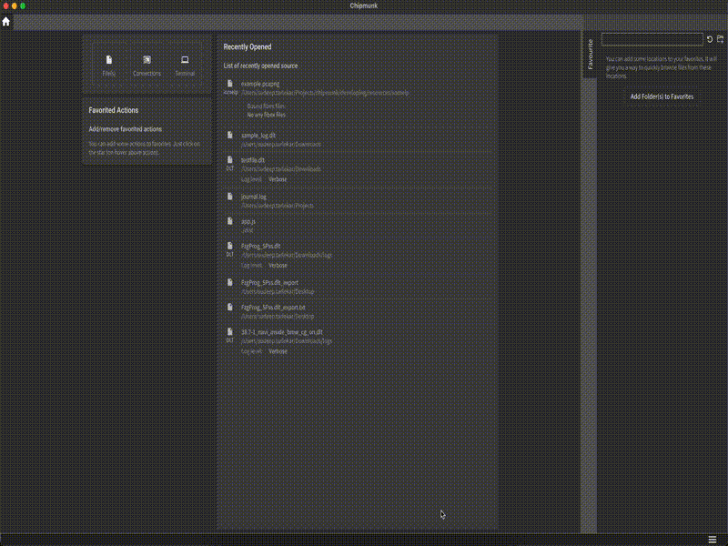
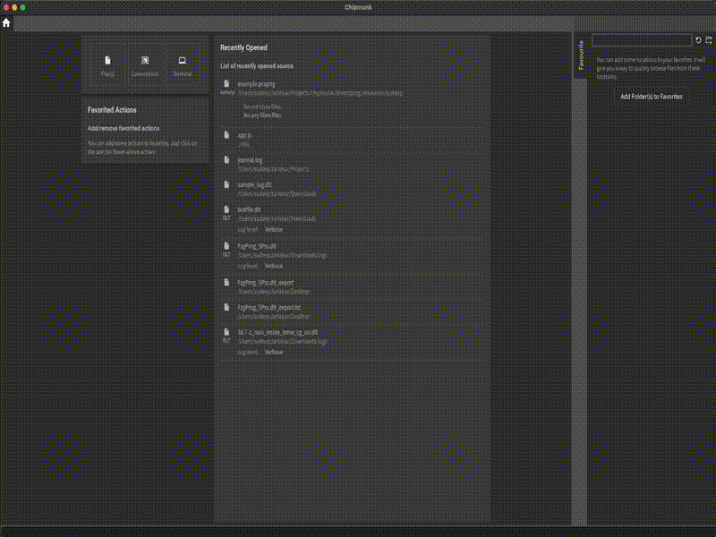

Chipmunk supports flexible import and export of log files, allowing users
to save, share, archive, or analyze logs with ease.
Once log files are imported into Chipmunk, users can export them as plain
text logs or binary files.

### Exporting Search Results

Chipmunk allows user to search specific string or value in the logs and create
a search filter for logs. These filters can also be exported as CSV or just
plain raw logs.

When exporting a filtered view, Chipmunk supports two formats:

**Table**

1. The search results are exported as a structured text, or in other words CSV file.
2. This format is useful when you want to process logs with spreadsheets or 
data analysis tools (Excel, pandas, etc.).

**Raw**

1. The filtered results are exported as a binary file.
2. Useful when user wants to share only filtered logs from Chipmunk.

### Exporting Selected Log Lines

In addition to exporting filtered logs, Chipmunk also allows users to manually
select specific lines from the log view and export only those entries.
This feature is particularly useful when you need to share or analyze a small
subset of log messages without exporting the entire file or applying complex
filters.

### Exporting filters and presets

Along with the logs user can also export the filters for later use and sharing,
find out more how user can export the filters from Chipmunk
[here](../search/#importing-exporting-presets)

### Exporting Streams

Chipmunk allows to render the streams of data from TCP or UDP.
User can also search through these streams and also can select particular lines
to export.

Please not that, exporting binary from streamed data is not yet possible in
Chipmunk.
