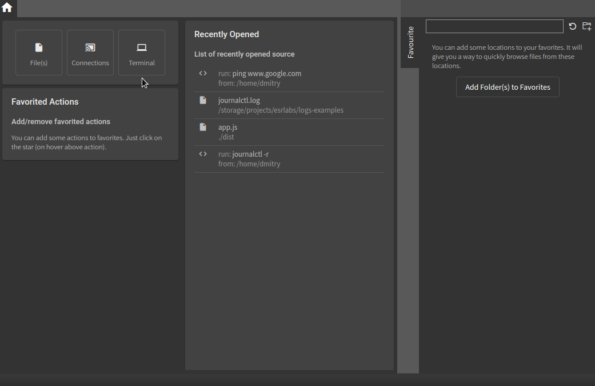

`chipmunk` is one of the fastest desktop applications for viewing log files, with no limitations on file size. 1 GB, 2 GB, 10 GB? `chipmunk` is limited only by your disk space - nothing more. With no caching and no unnecessary copying, files of any size open with the same speed. But `chipmunk` goes beyond just working with files: it also allows you to create network connections to collect logs via TCP, UDP, Serial, or from the output of a running command.

## Automotive and Network Traces

Out of the box, `chipmunk` supports several formats critical for the automotive industry, including DLT and SomeIp. Unlike many alternatives, `chipmunk` offers full trace inspection capabilities for DLT, including support for embedded attachments. Media files (images, video, audio) and text can be viewed directly within `chipmunk` or exported to disk.

Additionally, `chipmunk` allows you to work with DLT traces both as standalone files and as part of network captures saved in pcap or pcapng formats. DLT content can also be extracted from SomeIp packets.

## Log Collection

`chipmunk` supports the following input sources out of the box:

- TCP  
- UDP  
- Serial Port  
- Output from a command or program

For each source, you can assign a parser - for example, to collect DLT packets over a UDP connection for analysis or to save them as a standalone trace file.

Another key feature is the ability to launch any command or program and collect its output, which can be analyzed in real time as it's generated.

## Search

At its core, `chipmunk` is a log analysis tool. It goes beyond simple search queries: you can create filter sets, save them, and reuse them across sessions. An intuitive interface allows you to label filters with different colors for more effective analysis.

The search engine works dynamically - results are updated in real time as new data is added. If you're connected to a live data source, your active filters will continuously update the search results as new logs arrive.

## Metrics, Measurements, and Graphs

`chipmunk` includes a graphical tool for log analysis. You can define regular expressions to capture specific metrics and generate real-time charts to visualize their changes over time.

As with search, the graphical tool updates live as new content is streamed into the application.

