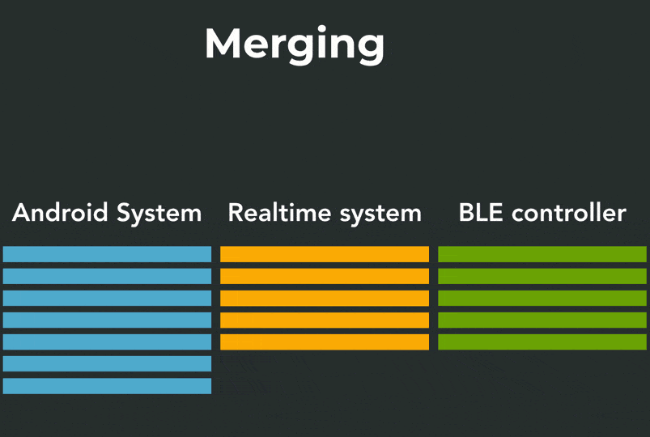
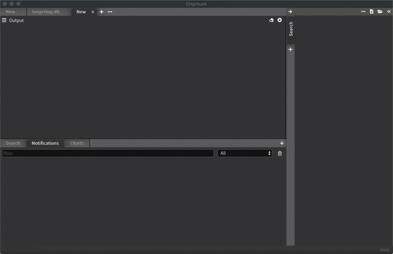

[back to overview](README.md)
# Merging

this is how merging works:

To help developers to deal with multiple logfiles, chipmunk can automatically detect timestamps and merge logs from multiple files.

