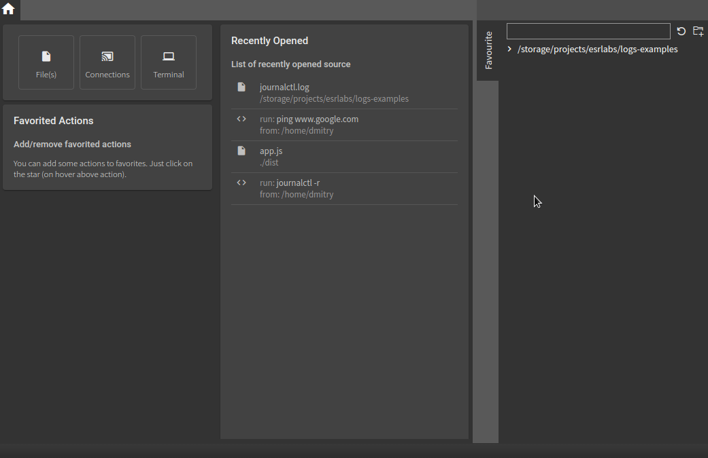

We’ve put a lot of effort into making the `chipmunk` interface simple and intuitive, despite the complexity of the tasks it performs. Based on the feedback we’ve received from users, we placed special emphasis on speed and ease of access to log file locations, as well as quick access to recent user activity.

### Quick navigation

To have quick access to places, where log files are stored, folder(s) can be added into favorites. On Chipmunk's home screen, all files from the favorites folder(s) will be listed with the possibility to filter them by name.

In addition to home screen favorites are also available with `Ctrl + P` (`Command + P`). In this case file(s) from favorite places are mixed with recent actions.

### Recent activities

Chipmunk tracks not only recently opened files but also recently created streams. 

The main list of recent actions is present on Chipmunk's home screen. But it is also available with `Ctrl + P` (`Command + P`). In this case, a recent actions list is mixed with file(s) from favorite places.

