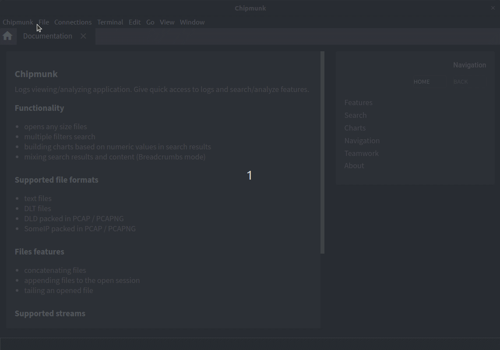

# Plugins Integrations in Chipmunk UI

This guide explains how to manage and use plugins directly within the Chipmunk application's user interface. For details on developing plugins or manually integrating plugin files, please refer to the [Plugins Development Guide](./development-guide.md).

## Plugins Manager

The Plugins Manager view shows all your integrated plugins, their status, logs, and associated README files. 
From here, you can add new plugins by selecting their directory, eliminating the need for manual file copying. 
The Plugins Manager also lets you remove plugins from the system, which permanently deletes their files from the Chipmunk home directory.

## Use a Parser Plugin

To use a parser plugin, first choose your data source (such as files, network streams, or process outputs). Then, select the desired parser from a dropdown list that includes all available parsers, both built-in and plugin-based.

## Visual Overview

Here is a small overview of the Plugins Manager and how to start a session using a parser plugin:

