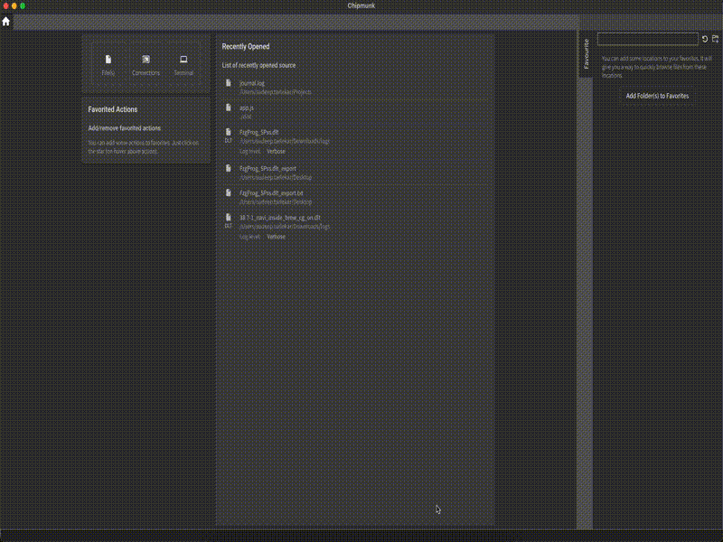

At the heart of `chipmunk` lies its powerful search functionality. `chipmunk` allows you to create sets of diverse search conditions (called filters), combine them, save them, and apply them as needed for different scenarios.

### Creating of filter

To create a filter:

- focus in search input
- enter the search condition
- press "Enter" to activate the search
- press "Enter" once again or click on the filter icon

As a result, the filter will be saved in a list of filters.
Chipmunk supports any number of filters/charts, but the performance of a search depends on the number of filters/charts.

### Active search

If some value is present in the search input - it's an active search and search results are present *only* for this filter.

Any saved filter can be quickly converted to active search via:
- context menu "Show matches"
- double-click on the filter in a list

### Managing filters

Checked/Unchecked/Disabled filters

- *Cheked* filer will be used to make a search and matches will be shown in a search results view.
- *Unchecked* filters will not be used to make a search, but colors still be applied and rows with matches will be highlighted in the main view.
- *Disabled* filter will not be considered in the search and will not be highlighted. Disabling filters are useful to turn off some filter completely but still have a way to quickly restore it

### Importing / Exporting Presets

Filters/charts will be associated with an opened file (or stream). Next time the same file (or stream) is opened, filters/charts will be restored.

At the same time, there are a couple of ways to export filters:

- via the context menu on the list of filters/charts
- via tab "History/Profiles" to export different collections of filters/charts

Just like the exorting the filter from the Chipmunk, user can also import the 
filters in the Chipmunk.

### Breadcrumbs

Breadcrumbs mode allows mixed search results and other content. It's very useful in cases when it's essential to understand what was logged before/after the target occasion.

