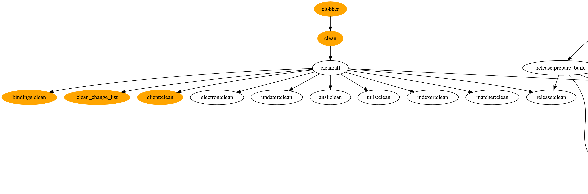
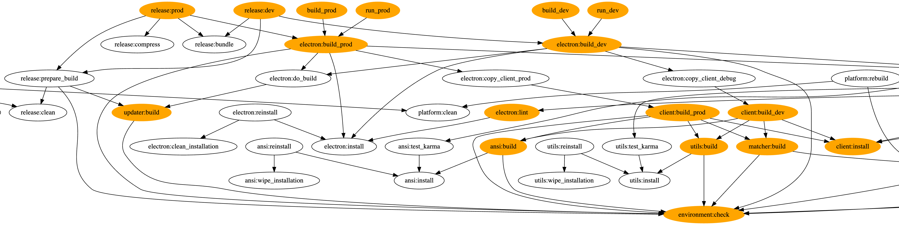
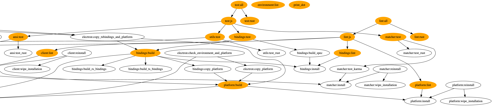

> [!NOTE]
> This system is deprecated and is kept here for reference purposes.
> Please use the [Chipmunk Development CLI Tool](../cli/development-cli) for all development tasks instead.

## Build System

In order to build and run chipmunk, several steps have to be executed:

* build all rust parts
* build all binding layers (rust and node)
* build various javascript parts
* build and bundle the electron application

We use `rake` as our build system. So a valid ruby needs to be present on the system in order to use
it.

The three main tasks to execute are:

* `rake clean` (clean everything)
* `rake lint:all` (run all lint checks)
* `rake test:all` (run all tests)
* `rake run_dev/run_prod` (to build and run chipmunk)
* `rake build_dev/build_prod` (to only build the complete application)
* `rake release:dev/release:prod` (to create a release package)

```
rake ansi:build           # Build ansi
rake ansi:test            # run ansi tests
rake bindings:build       # Build bindings
rake bindings:clean       # clean bindings
rake bindings:lint        # Lint TS bindings
rake bindings:test        # run binding tests
rake build_dev            # build chipmunk (dev)
rake build_prod           # build chipmunk (prod)
rake clean                # Remove any temporary products
rake clean_change_list    # Clean change list
rake client:build_dev     # Build client (dev)
rake client:build_prod    # Build client (prod)
rake client:clean         # clean client
rake client:install       # Install client
rake client:lint          # Lint client
rake clobber              # Remove any generated files
rake electron:build_dev   # build dev version of electron
rake electron:build_prod  # build production version of electron
rake electron:lint        # Lint electron
rake environment:check    # check that all needed tools are installed
rake environment:list     # list info of needed tools
rake lint:all             # lint everything
rake lint:js              # lint all js/ts modules
rake lint:rust            # lint all rust modules
rake matcher:build        # Build matcher
rake matcher:test         # run matcher tests
rake platform:build       # build platform
rake platform:lint        # Lint platform
rake print_dot            # overview of task dependencies
rake release:dev          # Create release (dev mode)
rake release:prod         # Create release (production mode)
rake run_dev              # start chipmunk (dev)
rake run_prod             # start chipmunk (prod)
rake test:all             # run all test
rake test:js              # test js/webassembly parts
rake test:rust            # test rust core
rake updater:build        # Build updater
rake utils:build          # Build utils
rake utils:test           # run utils tests
```




